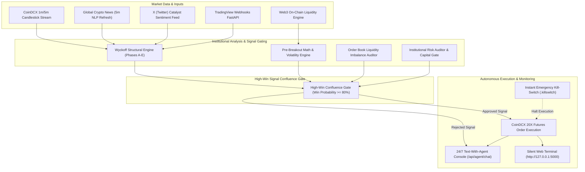

<div align="center">

# 🤖 People Trade AI — Built for People. Powered by AI.

[](#)
[](https://github.com/rammaruboina-rgb)
[](https://www.python.org/)
[](https://coindcx.com/)
[](#)
[](https://discord.gg/Gt3ZAfMWy)
[](HOW_IT_WORKS_AND_PSYCHOLOGY.md)
[](LINKEDIN_ANNOUNCEMENT.md)

<p align="center">
  <b>Democratizing Institutional Wyckoff Intelligence & High-Win Confluence Scalping for Everyone</b>
</p>

---

</div>

## 🌟 Executive Overview

**People Trade AI** is a state-of-the-art, 24/7 autonomous algorithmic futures trading agent engineered specifically for **CoinDCX Futures**. Designed around Richard D. Wyckoff's institutional market cycle theory, the agent continuously scans 125+ high-volume altcoins, detecting smart money accumulation, manipulation springs, and mark-up expansions while enforcing strict 20X isolated leverage risk boundaries.

Equipped with a **24/7 Text-With-Agent REST console**, a live 5-minute global NLP news sentiment engine, an on-chain Web3 whale liquidity tracker, and a real-time TradingView-integrated web terminal, **People Trade AI** operates completely silently without audio dependencies.

---

## ⚡ Core Institutional Features

### 🏛️ 1. Institutional Wyckoff Market Cycle Engine
- **Phase A (Stop Trend)**: Detects Preliminary Support (PS), Selling Climax (SC), and Automatic Rally (AR).
- **Phase B (Building Cause)**: Measures secondary tests (ST) and liquidity sweeps across resistance/support bounds.
- **Phase C (Smart Money Test)**: Pinpoints high-probability **Accumulation Springs** and **Distribution Upthrusts (UTAD)**.
- **Phase D (Sign of Strength)**: Identifies Last Point of Support (LPS) and Breakouts above Ice Line.
- **Phase E (Markup Expansion)**: Rides momentum continuation with trailing stop-loss protection.

### 🛡️ 2. High-Win Signal Gate & Risk Auditor
- **Multi-Engine Confluence**: Evaluates signals across 6 specialized engines (Wyckoff + Order Book + Math + Catalyst + Web3 + Risk Auditor).
- **Gate Threshold**: Trades are executed ONLY when signal confluence meets or exceeds the **80% Win-Probability Threshold**.
- **Full Market Asset Coverage**: Multi-token trading engine scanning BTC, ETH, and 125+ top altcoins for maximum high-win signal opportunities.

### 💬 3. 24/7 Text-With-Agent Console
- Interactive natural language interface accessible via HTTP REST (`POST /api/agent/chat`) or CLI (`./chat.sh`).
- Instant diagnostic responses for queries like `wyckoff`, `wallet`, `gate`, `news`, `pepe`, `sui`, or `start`.

### 📰 4. Global 5-Minute News & Web3 Whale Tracker
- **5-Min News Feed**: Auto-refreshes top crypto catalysts every 5 minutes with VADER/NLP sentiment scoring (-1.0 to +1.0).
- **Web3 Whale Inflows**: Tracks decentralized liquidity shifts and large wallet movements for explosive breakout setups.

### 🔒 5. Hardened Security & Manual-Only Withdrawals Policy
- **Automated Withdrawals Hard Disabled**: The agent contains ZERO withdrawal capabilities (`ALLOW_AUTOMATED_WITHDRAWALS = False`).
- **Manual Control Only**: Fund withdrawals can ONLY be initiated manually by the account owner inside the official CoinDCX App/Web.
- **API Scope Safety**: Read & Futures Trading permissions ONLY. Never enable Withdrawal permissions on your API key.

---

## 🏗️ System Architecture



---

## 📁 Repository Structure

```text
people-trade-ai/
├── dashboard_server.py         # Flask Web Dashboard & 24/7 Text-With-Agent REST Server
├── coindcx_master_agent.py     # Central Autonomous Execution Orchestrator
├── wyckoff_engine.py           # Institutional Wyckoff Structural Analysis Engine
├── risk_auditor.py             # High-Win Gate Auditor & Equity Risk Manager
├── position_manager.py         # 20X Isolated Futures Position Lifecycle Manager
│
├── coindcx_client.py           # CoinDCX API Client (Signed HTTP Requests & HMAC)
├── coindcx_futures_mapper.py   # Symbol Normalization & Contract Precision Mapper
├── strategy_engine.py          # Candle Pattern & Momentum Breakdown Analytics
├── math_engine.py              # ATR Volatility & Technical Indicator Calculations
├── orderbook_engine.py         # Order Book Imbalance & Depth Analysis
│
├── catalyst_engine.py          # News & Twitter Catalyst Sentiment Aggregator
├── news_client.py              # 5-Minute Global News Retriever & NLP Sentiment Engine
├── web3_model.py               # Web3 On-Chain Whale Inflow & Liquidity Tracker
├── scan_web3_coins.py          # Altcoin Momentum Scanner (125+ Tokens)
│
├── agent_chat.py               # Interactive CLI Chat Console Handler
├── chat.sh                     # Bash Launcher for CLI Text Agent Console
├── autotrade.sh                # Autonomous Bot Launcher Script
├── config.py                   # Master Trading Parameters & Risk Settings
│
├── requirements.txt            # Python Dependencies
├── .gitignore                  # Security Rules (Protects .env & Secrets)
└── README.md                   # System Architecture & Documentation
```

---

## 🛠️ Installation & Setup

### 1. System Requirements & Wallet Funding
- **OS**: Linux / macOS / WSL2
- **Python**: 3.9+
- **CoinDCX Account**: Valid Futures API Key & Secret

> [!IMPORTANT]
> **CRITICAL WALLET FUNDING REQUIREMENT**:
> To execute trades, you **MUST deposit or transfer funds into your CoinDCX USDT-M Futures Wallet**.
> - **Deposit Currency**: **USDT only** (INR or Spot wallet balances cannot be used directly for USDT-M Futures).
> - **Wallet Transfer Steps**: Open **CoinDCX App/Web** $\rightarrow$ **Wallets** $\rightarrow$ **Transfer** $\rightarrow$ Transfer **USDT** from **Spot/Main Wallet** $\rightarrow$ **USDT Futures Wallet**.
> - **Trading Margin**: The agent reads available equity directly from your **USDT Futures Wallet**. Without USDT in the Futures Wallet, order placement will be rejected for insufficient margin!

### 2. Clone Repository
```bash
git clone https://github.com/rammaruboina-rgb/people-trade-ai.git
cd people-trade-ai
```

### 3. Virtual Environment & Dependencies
```bash
# Create virtual environment
python3 -m venv venv
source venv/bin/activate

# Install dependencies
pip install -r requirements.txt
```

### 4. Security Configuration (`.env`)
Create a `.env` file in the root directory (**Never commit this file!**):
```ini
COINDCX_API_KEY=your_coindcx_api_key_here
COINDCX_API_SECRET=your_coindcx_api_secret_here
MODE=LIVE
```

---

## 🚀 Usage & Operating Modes

### Mode 1: Launch Silent Dashboard & Agent Server
Start the dashboard web server on `http://127.0.0.1:5000`:
```bash
python dashboard_server.py
```
Open **`http://127.0.0.1:5000`** in your browser to view live TradingView charts, real-time trade tapes, console logs, and text with the agent.

### Mode 2: Interactive Text Console (CLI)
Interact with the agent directly from the terminal:
```bash
./chat.sh
```
*Supported Query Badges*: `wyckoff`, `wallet`, `gate`, `news`, `sui`, `pepe`, `status`.

### Mode 3: Targeted Single-Coin Mode
Run the agent focused exclusively on one coin (e.g. SUI):
```bash
python coindcx_master_agent.py --coin SUI
```

---

## ⚙️ Institutional Risk & Safety Parameters

All core risk parameters are configured in `config.py`:

| Parameter | Value | Description |
| :--- | :--- | :--- |
| **`LEVERAGE`** | `20X` | Fixed Isolated Futures Leverage |
| **`WIN_RATE_THRESHOLD`** | `80%` | Minimum Confluence Score for Entry |
| **`PROFIT_TARGET_PCT`** | `+20.0%` | Primary Take-Profit Target (ROE) |
| **`STOP_LOSS_PCT`** | `-10.0%` | Hard Stop-Loss Boundary (ROE) |
| **`BREAKEVEN_PROFIT_PCT`**| `+5.0%` | Move Stop-Loss to Entry Price |
| **`SYMBOL_BLACKLIST`** | `[]` | Multi-Asset Coverage (BTC, ETH, Altcoins Enabled) |

---

## 🛑 Emergency Kill-Switch

To immediately halt trading and close all open futures positions:
```bash
touch .killswitch
```
Or click the **`EMERGENCY KILL-SWITCH`** button inside the web dashboard.

---

## 💬 Community & Discord Support

Join our official live Discord community for strategy discussions, market updates, and trading support:

👉 **[Join People Trade AI Discord Server](https://discord.gg/Gt3ZAfMWy)**  
*Discord Link:* `https://discord.gg/Gt3ZAfMWy`

---

## 👤 Author & Maintainer

Maintained by **[rammaruboina-rgb](https://github.com/rammaruboina-rgb)** 🚀

---

## ⚠️ Risk Disclaimer

*This repository contains automated algorithmic cryptocurrency trading software. Cryptocurrency futures trading involves significant financial risk. Always test configuration parameters thoroughly before deploying capital.*
