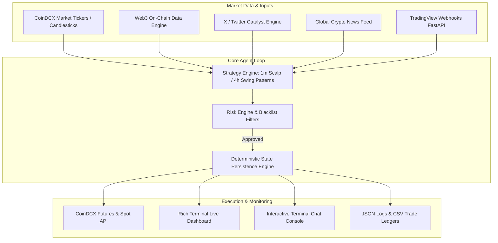

# 🤖 People Trade AI — Autonomous Trading Agent & Wyckoff Intelligence Console

[](#)
[](https://github.com/rammaruboina-rgb)
[](https://www.python.org/)
[](https://coindcx.com/)
[](#)

**People Trade AI** is an autonomous, multi-strategy **CoinDCX algorithmic trading agent** built for 24/7 altcoin scalping (1m/5m) and institutional Wyckoff market cycle structure analysis. Developed and maintained by **[rammaruboina-rgb](https://github.com/rammaruboina-rgb)**.

Featuring an interactive **Text-With-Agent** console, live Web3 on-chain whale tracker, global 5-minute crypto news stream, and real-time live trading dashboard.

---

## 🌟 Key Features

- **⚡ Deterministic State Machine Engine**: Maintains trade lifecycles across 7 deterministic states:
  $$\text{SCAN} \longrightarrow \text{EVALUATE} \longrightarrow \text{PRE\_TRADE} \longrightarrow \text{OPEN} \longrightarrow \text{MANAGE} \longrightarrow \text{EXIT} \longrightarrow \text{REVIEW}$$
- **🎯 Pure Altcoin Focus & Targeted Coin Mode**:
  - Automatically filters & scans **125+ top altcoins and meme tokens** (SUI, PEPE, NEAR, AVAX, WLD, etc.).
  - Supports CLI targeted coin focus (e.g. `--coin SUI` to trade only SUI or a single selected coin).
  - Explicit symbol blacklist guard preventing accidental trades on BTC or ETH.
- **🐋 Web3 & Catalyst Intelligence**:
  - **On-Chain Whale Tracker**: Scans Web3 transactions and liquidity inflows/outflows for explosive momentum signals.
  - **X (Twitter) Sentiment Engine**: Monitors top crypto leaders, influencers, and token metrics via X API.
  - **Global News Aggregator**: Real-time 5-minute news feed refresh with NLP-based market sentiment scoring (-1.0 to +1.0).
- **🛡️ Institutional Risk Management & Kill-Switches**:
  - Max equity per-trade risk cap & position sizing calculations based on ATR distance.
  - Daily loss limit stop (`DAILY_LOSS_LIMIT_USD`) and daily profit lock target.
  - Dynamic stop-loss trailing (+5% profit breakeven move, +20% target exits).
  - **Instant Emergency Kill-Switch**: Listens for `.killswitch` trigger file or environment flag to halt trading and close all open positions safely.
- **📡 TradingView Webhook Server**: Embedded FastAPI server to process signals directly from external TradingView alerts.
- **🖥️ Live Terminal Dashboard & Chat Console**:
  - Built with `Rich` for a flicker-free, multi-panel live view of metrics, open positions, recent fills, catalyst feeds, and engine logs.
  - Interactive terminal chat console (`chat.sh`) to query balance, check trending coins, news, or manually command the bot.

---

## 🏗️ System Architecture



---

## 📁 Repository Structure

```text
coindcxagent/
├── run_all.py                 # Single-terminal master interactive runner & dashboard
├── start_agent.sh             # Bash launcher script (Swing vs High-Leverage mode)
├── chat.sh                    # Interactive CLI chat console launcher
├── agent_chat.py              # Conversational agent interface for queries & commands
│
├── coindcx_master_agent.py    # Central orchestrator integrating all engines
├── coindcx_agent_futures_stp.py # Futures trade execution, trailing stops, & orders
├── coindcx_client.py          # CoinDCX API HTTP & signature authentication client
├── coindcx_futures_mapper.py  # Symbol normalization & futures contract mapping
│
├── strategy_engine.py         # Pattern detection (Engulfing, Hammers, Wick Reclaims)
├── risk_engine.py             # Position sizing, drawdown limits & kill-switch guards
├── catalyst_engine.py         # Global market catalyst aggregation
├── web3_model.py              # On-chain whale inflows & Web3 liquidity tracking
├── scan_web3_coins.py         # Web3 coin scanner & momentum ranker
├── tweet_monitor.py           # X / Twitter influencer & sentiment analyzer
├── x_client.py                # X (Twitter) API v2 client integration
├── news_client.py             # Global news retriever & sentiment scoring
├── webhook_server.py          # FastAPI listener for TradingView Webhook signals
│
├── dashboard_unified.py       # Live Rich UI terminal dashboard app
├── data_store.py              # In-memory & JSON state store manager
├── config.py                  # Global parameters, risk settings, & coin whitelists
│
├── SOUL.md                    # Core bot identity, trading values, and boundaries
├── QUALITY_SPEC.md            # System quality specification & lifecycle states
├── requirements.txt           # Python dependencies
└── .env                       # Environment credentials (API Keys & Tokens)
```

---

## 🛠️ Installation & Setup

### 1. Prerequisites
- Python 3.9 or higher
- A valid [CoinDCX](https://coindcx.com/) Account with API Key and Secret
- (Optional) X / Twitter API credentials for social sentiment monitoring

### 2. Clone & Environment Setup
```bash
# Clone the repository
git clone https://github.com/rammaruboina-rgb/people-trade-ai.git
cd people-trade-ai

# Create and activate python virtual environment
python3 -m venv venv
source venv/bin/activate

# Install dependencies
pip install -r requirements.txt
```

### 3. Configure Credentials (`.env`)
Create a `.env` file in the root directory (or update existing):
```ini
COINDCX_API_KEY=your_coindcx_api_key
COINDCX_API_SECRET=your_coindcx_api_secret
MODE=LIVE

# Optional X / Twitter API Credentials
X_CONSUMER_KEY=your_x_consumer_key
X_CONSUMER_SECRET=your_x_consumer_secret
X_BEARER_TOKEN=your_x_bearer_token
X_ACCESS_TOKEN=your_x_access_token
X_REFRESH_TOKEN=your_x_refresh_token
```

---

## 🚀 Usage & Operating Modes

### Mode 1: Master Interactive Dashboard & Scalper
Launch the full master runner with live rich terminal dashboard:
```bash
python run_all.py
```
*Press `ENTER` on launch to trade all 125+ supported altcoins, or type a specific coin ticker (e.g. `SUI`, `PEPE`, `NEAR`).*

### Mode 2: Targeted Coin Focus Mode (CLI)
Focus execution exclusively on a single altcoin:
```bash
python run_all.py --coin SUI
```

### Mode 3: Autonomous Swing Agent Launcher
Run via bash launcher:
```bash
# Default: Multi-day swing trading
./start_agent.sh

# High-leverage 20-minute scalp mode
MODE=highleverage ./start_agent.sh
```

### Mode 4: Interactive Terminal Chat Console
Launch the interactive command console to query account state and market analytics:
```bash
./chat.sh
```
*Supported query commands:* `balance`, `trending`, `news`, `tweets`, `status`, `equity`, `pnl`, or focus commands like `SOL`, `PEPE`, `NEAR`.

### Mode 5: TradingView Webhook Listener
Enable webhook processing by running:
```bash
WEBHOOK_ENABLED=true WEBHOOK_PORT=5000 python run_all.py
```

---

## ⚙️ Configuration & Risk Customization

All trading settings are centralized in `config.py`:

| Parameter | Default | Description |
| :--- | :--- | :--- |
| `EQUITY_USD` | `$9.52` | Base capital equity reference |
| `DEFAULT_MAX_DAILY_TARGET_USD` | `$20.00` | Target daily profit target |
| `DAILY_LOSS_LIMIT_USD` | `$9.52` | Hard daily loss limit before kill-switch |
| `MAX_CONCURRENT_TRADES` | `5` | Maximum active concurrent positions |
| `LEVERAGE` | `20` | Default leverage multiple (20X isolated) |
| `TIMEFRAME` | `1m` | Primary candlestick timeframe |
| `PROFIT_TARGET_PCT` | `0.20` | Default Take-Profit (+20.0%) |
| `STOP_LOSS_PCT` | `0.10` | Default Stop-Loss (-10.0%) |
| `BREAKEVEN_PROFIT_PCT` | `0.05` | Move Stop-Loss to Breakeven at +5.0% profit |

---

## 🛑 Emergency Controls & Kill-Switch

To instantly stop trading and liquidate all open positions:
1. **File Trigger**: Create a `.killswitch` file in the project root:
   ```bash
   touch .killswitch
   ```
2. **Environment Variable**: Set `KILL_SWITCH=true` in `.env`.

---

## 📊 Auditing & State Persistence

Trade executions, signals, and post-trade debriefs are recorded continuously in:
- `state/open_positions.json`: Active trade snapshot with entry, SL, TP, and sizing.
- `state/trade_log.json`: Post-trade evaluation objects and R-multiple tracking.
- `trades_unified.csv`: CSV ledger of all filled orders.
- `trading_bot.log`: Detailed engine logs.

---

## 👤 Author & Maintainer

Created & Maintained by **[rammaruboina-rgb](https://github.com/rammaruboina-rgb)** 🚀

---

## ⚠️ Disclaimer

*This software is created for automated cryptocurrency trading research and execution on CoinDCX. Cryptocurrency trading involves substantial financial risk. Use at your own risk. Always verify configuration settings and test thoroughly prior to executing live funds.*
